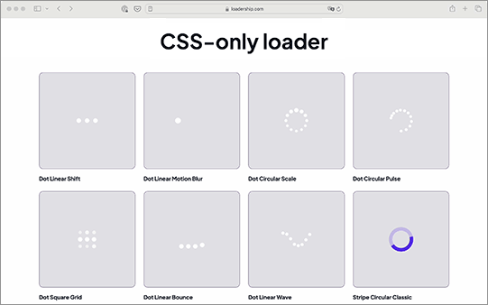

# Loadership.com

<div style="text-align: center;">
    
</div>

[LoaderShip.com](https://loadership.com) is the ultimate CSS-only loader configuration tool that allows you to effortlessly customize and generate stunning loaders for your website. Simply Copy & Paste without any installation or dependency hassle.

<div style="text-align: center;">
    
</div>

### Features

- Rich collection
- No login required
- No dependencies
- Customizable loaders
- Completely free
- Realtime preview

### Development

Loadership is scaffolded using vite + bun. To run the development server, follow the steps below:

1. Clone the repository

```bash
git clone https://github.com/ccc159/loadership.git
```

2. Install dependencies

```bash
bun install
```

3. Run the development server

```bash
bun dev
```

4. Open the browser and navigate to http://localhost:3000

5. Build the project

```bash
bun build
```

### License

MIT
